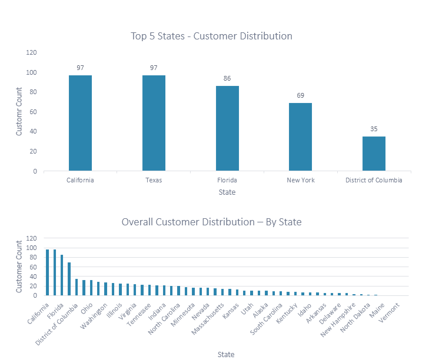

### Overview

The New-Wheels Data Transformation project aimed to address the challenges faced by the New-Wheels app, focusing on sales descent, reputation hit, and a drop in new customers. The objective was to provide actionable insights for informed decision-making and identify avenues for business enhancement.

### Objective:
- Provide actionable insights for informed decision-making.
- Identify avenues for business enhancement.

### Business Context:

- Universal Desire: People worldwide crave vehicle ownership for mobility freedom.
- Affordable Mobility: Pre-owned vehicles gaining popularity for cost-effectiveness.
- After-sales Assurance: Concerns about resale vendor service addressed by New-Wheels app.
- End-to-end Experience: New-Wheels app—from listing to doorstep delivery—ensures a seamless process.
- Customer-centric: App captures valuable after-sales feedback, prioritizing satisfaction.


<span style="font-size: 8pt;">*Picture reference: [Project Internal]*</span>

## Project Insights

1. **Financial Overview**
   - Total Revenue: $83.12M over four quarters
   - Total Orders: 1000
   - Total Customers: 994
   - Average Rating: 3.135
   - Last Quarter Revenue: $15.28M
   - Last Quarter Orders: 199
   - Average Days to Ship: 97.96
   - % Good Feedback: 44.10%

2. **Customer Distribution Across States**
   - California and Texas have the highest customer distribution (97 each).
   - Florida has 86 customers, indicating a robust market presence.
   - District of Columbia has a relatively high customer count (35).
   - States like Vermont, Maine, and North Dakota have low customer distribution, indicating potential areas for market expansion.
   - Ohio, Washington, and Illinois have significant customer bases, suggesting opportunities for business expansion.
     

<span style="font-size: 8pt;">*Picture reference: [Project Microsoft Excel Report]*</span>

3. **Average Customer Rating – By Quarter**
   - Average rating exhibits a consistent decline over the four quarters, indicating potential issues with customer satisfaction or product/service quality.
   - The most substantial decline is observed between the first quarter (3.55) and the fourth quarter (2.40).
     

<span style="font-size: 8pt;">*Picture reference: [Project Microsoft Excel Report]*</span>

4. **Trend of Customer Satisfaction**
   - Noticeable shift in customer sentiment, with a significant increase in 'Very Bad' and 'Bad' responses.
   - Quarter 4 shows a considerable increase in 'Very Bad' responses (30.65%), indicating a decline in customer satisfaction.
   - Decrease in responses in 'Okay' and 'Good' categories, emphasizing the need for comprehensive analysis.

5. **Top Vehicle Makers Preferred by Customers**
   - Chevrolet has the highest total customer count (83), indicating a strong market presence.
   - Ford, Toyota, Pontiac, and Dodge follow closely.
   - Competitive landscape observed between Toyota, Pontiac, and Dodge.
     
##### Code Snippet: Top 5 Vehicle Makers by Total Customers

```sql
SELECT PRODUCT_T.VEHICLE_MAKER, COUNT(ORDER_T.CUSTOMER_ID) AS TOTAL_CUSTOMERS
FROM ORDER_T, PRODUCT_T
WHERE ORDER_T.PRODUCT_ID = PRODUCT_T.PRODUCT_ID
GROUP BY PRODUCT_T.VEHICLE_MAKER
ORDER BY TOTAL_CUSTOMERS DESC
LIMIT 5;
```

<span style="font-size: 8pt;">*Picture reference: [Project Microsoft Excel Report]*</span>

6. **Most Preferred Vehicle Make in Each State**
   - Preferences vary across states, e.g., Alabama prefers Dodge, Alaska prefers Chevrolet, Florida prefers Toyota.
   - Some states have ties in customer count for different vehicle makes.

7. **Trend of Purchases by Quarter**
   - Gradual decline in purchases over four quarters, suggesting potential market factors.
   - Strong start in Q1 with high purchases; lowest in Q4.

##### Code Snippet: Quarter-on-Quarter Revenue Change

```sql
WITH RevenueByQuarter AS (
    SELECT
        quarter_number,
        SUM(o.VEHICLE_PRICE) AS total_revenue
    FROM
        order_t o
    GROUP BY
        quarter_number
)
SELECT
    quarter_number,
    total_revenue,
    LAG(total_revenue) OVER (ORDER BY quarter_number) AS previous_quarter_revenue,
    (total_revenue - LAG(total_revenue) OVER (ORDER BY quarter_number)) / LAG(total_revenue) OVER (ORDER BY quarter_number) * 100 AS qoq_percentage_change
FROM
    RevenueByQuarter;

```

8. **Quarter on Quarter % Change in Revenue**
   - Consistent decrease in total revenue, with the highest drop from Q3 to Q4.

##### Code Snippet: Quarterly Revenue and Order Count

```sql
SELECT quarter_number, SUM(vehicle_price) AS Revenue, COUNT(order_id) AS Orders
FROM order_t
GROUP BY quarter_number
ORDER BY quarter_number;
```

9. **Trend of Revenue and Orders by Quarter**
   - High revenue and order count in Q1; continuous decrease in Q3 and Q4.
   - Lowest revenue and order count in Q4, indicating potential challenges.

10. **Average Discount Offered by Credit Card Type**
    - Notable range in discount percentages across different credit card types.
    - Top three credit card types with the highest discount rates: 'laser' (64.38%), 'mastercard' (62.95%), 'maestro' (62.42%).
      

<span style="font-size: 8pt;">*Picture reference: [Project Microsoft Excel Report]*</span>

11. **Time Taken to Ship Orders by Quarter**
    - Average shipment time consistently increases from 57.17 days in Q1 to 174.10 days in Q4.
    - Q1 demonstrates a relatively shorter average shipment time, while Q4 shows the longest time.

## Next Steps
Based on these conclusions, the project team recommends further analysis and targeted actions to address specific challenges highlighted in the findings.
